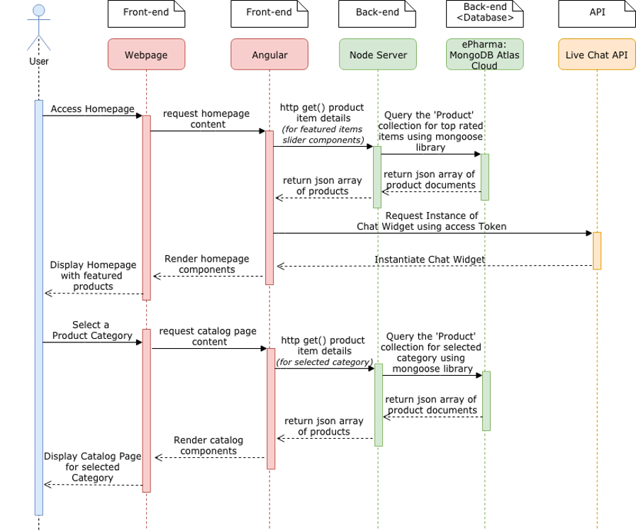

# Epharma

This project was generated with [Angular CLI](https://github.com/angular/angular-cli) version 7.3.0.
Epharma is an e-commerce application to help users to purchase medicines at the comfort of their homes. They can shop for a variety of on-the-counter drugs. If they do require a prescription medication, they would have to upload their prescription on the website and a local pharmacist would take a look at the prescription.

## Sequence Diagram of Epharma

Given below is the sequence of interactions on the Epharma website. The interactions between components take place in an MVC oriented manner.

## Running the applciation

Follow the steps to run the application:

1. At the root of the application run npm install
2. Run npm start
3. cd server/ and then run the following commands in the given sequence: npm install, npm install bcrypt, npm start

## Development server

Run `ng serve` for a dev server. Navigate to `http://localhost:4200/`. The app will automatically reload if you change any of the source files.

## Code scaffolding

Run `ng generate component component-name` to generate a new component. You can also use `ng generate directive|pipe|service|class|guard|interface|enum|module`.

## Build

Run `ng build` to build the project. The build artifacts will be stored in the `dist/` directory. Use the `--prod` flag for a production build.

## Running unit tests

Run `ng test` to execute the unit tests via [Karma](https://karma-runner.github.io).

## Running end-to-end tests

Run `ng e2e` to execute the end-to-end tests via [Protractor](http://www.protractortest.org/).

## Further help

To get more help on the Angular CLI use `ng help` or go check out the [Angular CLI README](https://github.com/angular/angular-cli/blob/master/README.md).
